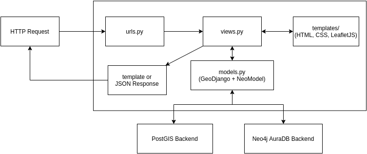
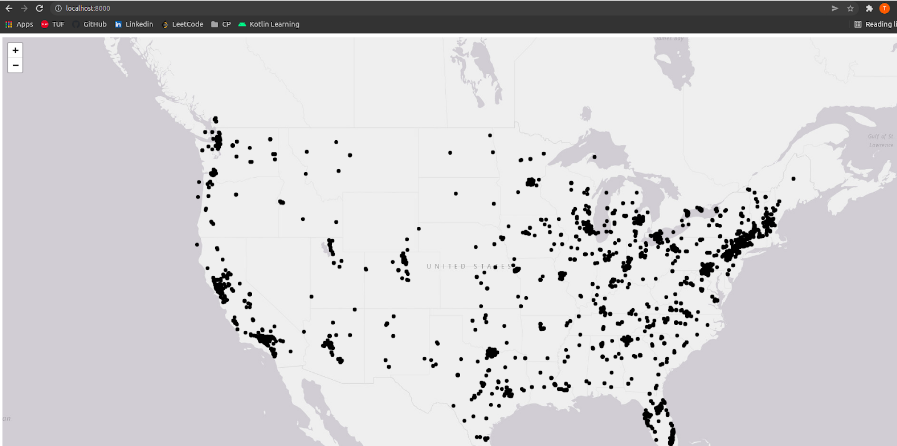
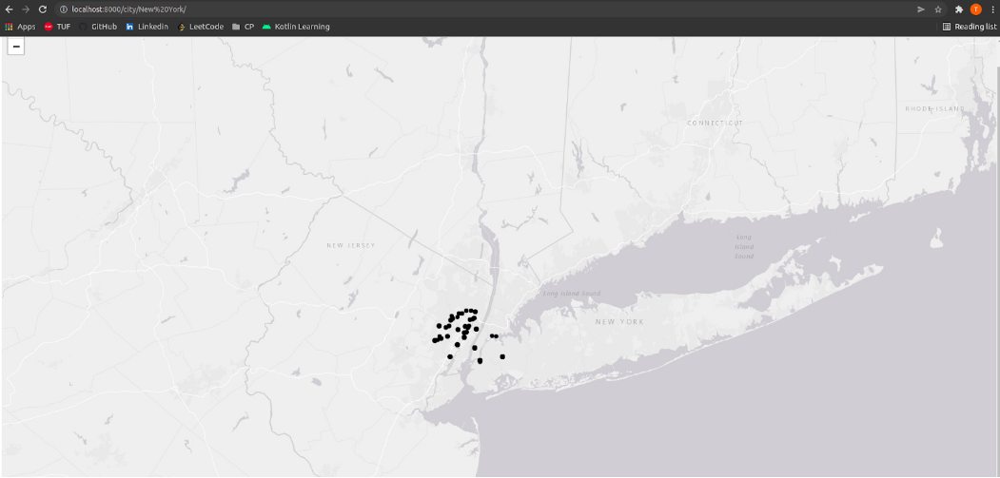
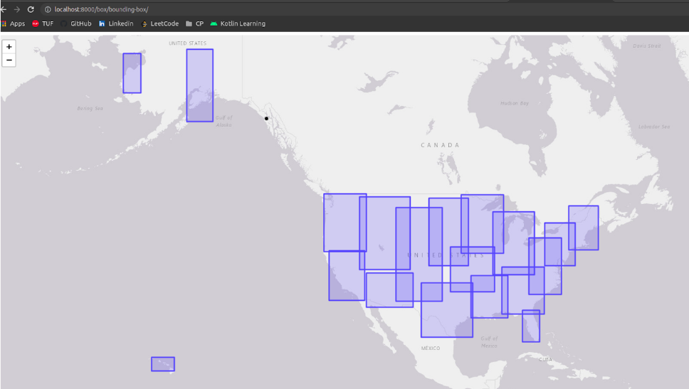
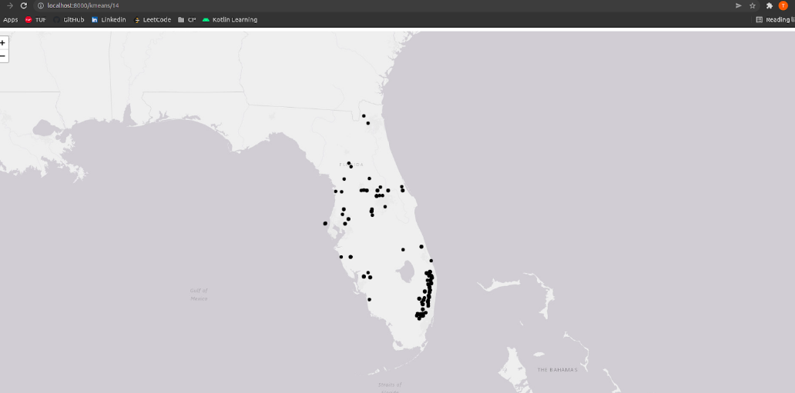
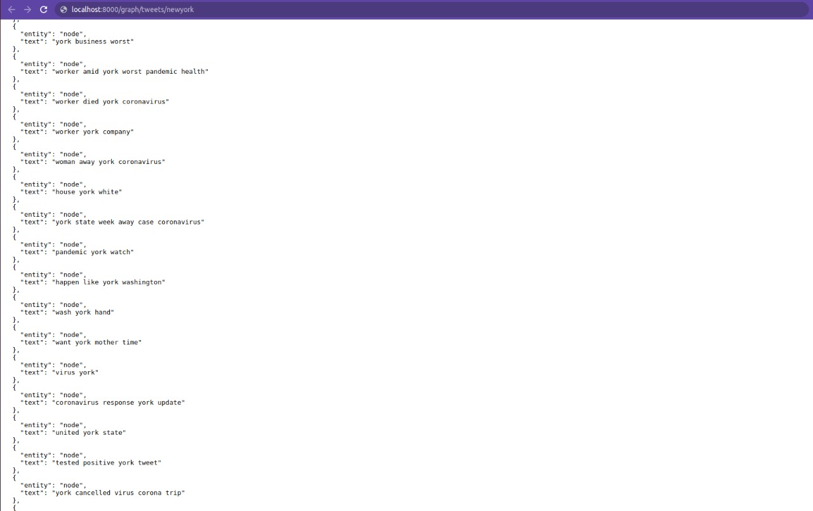

# TweeHeat

<p align="center">
  <a href="https://github.com/pk-218/TweeHeat">
    
  </a>
</p>

## 📌 About
In our project we tried to understand the trending topics of different regions of the United States of America, one of the highly COVID-19 affected countries, find the relationship between the topics, visualize the data by various geospatial functions using the dataset of geo-tagged tweets made during the pandemic. 

Spatial & Graph Databases Lab Project - __TweeHeat__    
_Group 16_
- 191080010 - [Tushar Bauskar](https://github.com/tusharsb-12)
- 191080038 - [Utsav Khatu](https://github.com/utsavk28)
- 191080040 - [Pankaj Khushalani](https://github.com/pk-218)

## 🎯 Key Features
* Visualize all the tweets by their location on the map

* Obtain visualization of the tweets by location such as tweets from a state, tweets around particular location using ST_DistanceSphere and ST_Within spatial functions

* Cluster the tweets by their location using ST_ClusterKMeans spatial function

* Generate bounding boxes for the clusters using ST_Envelope spatial function

* Manipulate the Neo4j graph database using Cypher queries


## ⛓ Web Application Architecture


</br>

## 🛠 Project Setup
1. Clone the GitHub repository using Git.

    ```
    git clone https://github.com/pk-218/TweeHeat.git
    cd TweeHeat
    ```

You can now see a project with the following file structure:
```
TweeHeat
  ├─ README.md
  ├─ data
  │  ├─ shape files
  │  │  ├─ States_shapefile.cpg
  │  │  ├─ States_shapefile.dbf
  │  │  ├─ States_shapefile.prj
  │  │  ├─ States_shapefile.shp
  │  │  └─ States_shapefile.shx
  │  └─ spatial_tweets.csv
  ├─ manage.py
  ├─ requirements.txt
  ├─ tweeheat
  │  ├─ __init__.py
  │  ├─ asgi.py
  │  ├─ settings.py
  │  ├─ urls.py
  │  └─ wsgi.py
  └─ tweets
     ├─ __init__.py
     ├─ admin.py
     ├─ apps.py
     ├─ load.py
     ├─ migrations
     │  ├─ 0001_initial.py
     │  ├─ 0002_clusterbox.py
     │  ├─ 0003_alter_clusterbox_box.py
     │  └─ __init__.py
     ├─ models.py
     ├─ static
     │  └─ tweets
     │     ├─ map.js
     │     ├─ map_boundingbox.js
     │     ├─ map_city.js
     │     ├─ map_kmeans.js
     │     └─ map_state.js
     ├─ templates
     │  └─ tweets
     │     ├─ base.html
     │     ├─ map.html
     │     ├─ map_boundingbox.html
     │     ├─ map_city.html
     │     ├─ map_kmeans.html
     │     └─ map_state.html
     ├─ tests.py
     └─ views.py
```

2. Open the extracted folder in a terminal. We have to create a Python virtual environment. For creating it, use the following command
    ```
    virtualenv venv
    ```

3. Activate the virtual environment using the following command   
    ```
    source venv/bin/activate
    ```

4. The extracted folder has a file named requirements.txt. It has all the dependencies required for the project with their versions. Install the dependencies using the following command    
    ```
    pip install -r requirements.txt
    ```

5. Set up the pgAdmin database by changing the database properties in the settings.py file of the project folder. Also add the graph database credentials using neomodel.config.
    ```python
    DATABASES = {
    'default': {

        'ENGINE': 'django.contrib.gis.db.backends.postgis',
        'NAME': <database_name>,
        'USER': <user_name>,
        'PASSWORD': <password>,
        'HOST': <host_name>,
        'PORT': <port>  
    }

    # for the graph database
    from neomodel import config
    config.DATABASE_URL = 'neo4j+s://<id>.databases.neo4j.io'
    config.username = <user_name>
    config.password = <password>
    ```

6. To create the database tables, run the following command
    ```
    python manage.py makemigrations
    python manage.py migrate
    ```

7. Now, to import the data. Open pgAdmin on local machine and import the CSV from TweeHeat/data/spatial_tweets.csv in TWEETS_TWEETS table using the Import tool in the pgAdmin GUI.

8. To import the states geometry in TWEETS_STATES table, run the following commands
	```
    python manage.py shell
	>> from tweets import load
	>> load.run()
    ```

9. Now run the project using 
    ```
    python manage.py runserver
    ```

## 📸 Results
* Base Map - The World Light Gray Basemap from the ArcGIS web server is rendered using vanillaJS.


* Get all tweets location - On the base URL, the base map is shown with several points plotted on it, indicating the location of the geo-tagged tweets.



* Tweets around a City - The below screenshots shows the tweets located in New York on the endpoint BASE_URL/city/<city> where state is a parameter.



* Tweets from a State - On the URL BASE_URL/state/<state>, the tweets of Mexico state are visualized as shown.


* Bounding Boxes - Using the ClusterBox model as created earlier, the spatial functions ST_Envolope and ST_ClusterKMeans are  employed to obtain the minimum bounding boxes across regions of the USA.
The endpoint for bounding boxes is BASE_URL/box/bounding-box


* Tweets by a Cluster - The endpoint for getting tweets by cluster is BASE_URL/kmeans/<cluster_id>


* Tweets by State from Knowledge Graph - On the endpoint BASE_URL/graph/tweets/<state>, the processed tweets as part of the knowledge graph can be fetched for a particular state (here, New York state) and can be viewed as JSON.


* Data as JSON - Other endpoints of the Django web application provide the above data in terms of JSON that can be used for further analysis such as:
    - json/all-tweets/
    - json/tweets-around/<city>
    - json/state/<state>
    - json/kmeans/<k>/<cluster_id>
    - json/bounding-box


## 🌐 Conclusion

- The tweets dataset was converted into spatial form and then spatial queries were implemented to obtain the results. 

- For creating the knowledge graph, NLP methods of keyword extraction were used and then a graph database was created using the relationship between the keywords, tweets and the state from which it was tweeted.

- Due to the computational limitations and large size of the dataset, we were not able to run the spatial queries on the complete data, instead we had to limit it down to few thousands, so that the web application could work smoothly. 

- Also, as the free instance of Neo4J AuraDB allowed only 50K nodes and 150K relationships, importing the complete dataset on the graph database was not possible.
